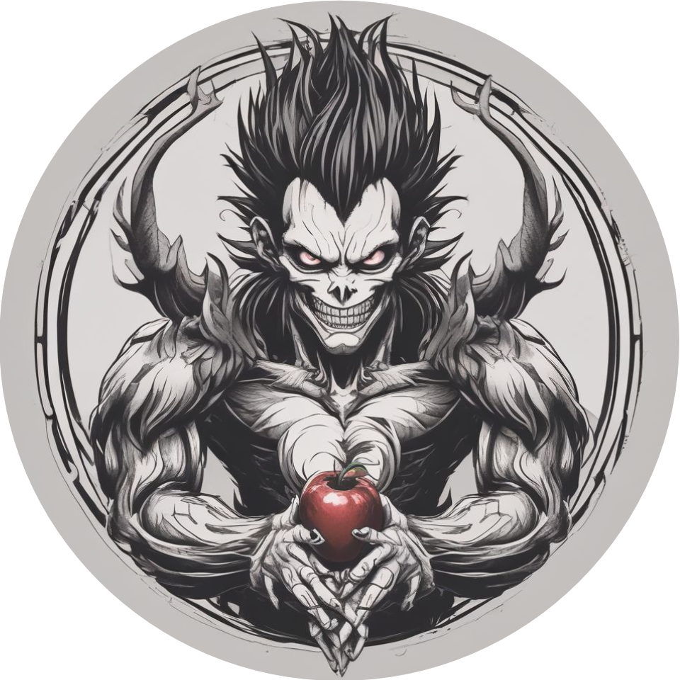

<div align="center">
  

  ***Bitcoin Script VM in Cairo***

<a href="https://github.com/keep-starknet-strange/shinigami/actions/workflows/check.yml"></a>

<a href="https://bitcoin.org/"> </a>
<a href="https://www.cairo-lang.org/"> </a>
<a href="https://react.dev/"> </a>

<a href="https://exploration.starkware.co/"></a>
<a href="https://t.me/ShinigamiStarknet"></a>
<a href="https://x.com/BitcoinWildlife"></a>

</div>

## Overview

`shinigami` is a library for generic Bitcoin Script execution in Cairo, enabling the generation of STARK proofs for Bitcoin Script computation and Bitcoin transaction execution.

Key features :

- Bitcoin Script interpretation and execution
- Transaction execution and proving
- Frontend Script IDE with STARK prover integration
- Easily configurable VM ( enable different opcodes )
- In cairo, Bitcoin Script compiler

## Usage

### Running

#### Execute Mainnet Transaction

```bash
scarb build
./scripts/run_bitcoin_transaction.sh <tx-id>
```

#### Example ( 1st Bitcoin Transaction )

```bash
scarb build
./scripts/run_bitcoin_transaction.sh f4184fc596403b9d638783cf57adfe4c75c605f6356fbc91338530e9831e9e16
```

#### Execute custom script

```bash
./scripts/run_script.sh <quoted-script>
```

#### Example ( Basic addition script )

```bash
./scripts/run_script.sh "OP_1 OP_2 OP_ADD OP_3 OP_EQUAL"
```

#### Other commands

Check out [this file](https://github.com/keep-starknet-strange/shinigami/blob/main/packages/cmds/src/main.cairo) to see other types of commands you can use with Shinigami!

### Building

```bash
scarb build
```

This will compile all the components.

### Testing

```bash
scarb test
```

This will run the test-suite for all opcodes, integration, and testing Scripts.

### Dependencies

The following are required to use / run shinigami :

- [scarb](https://docs.swmansion.com/scarb/)

## References

- [How To Contribute](./CONTRIBUTING.md)
- [Shinigami Supported Opcodes](./resources/supported-opcodes.md)
- [Shinigami Telegram](https://t.me/ShinigamiStarknet)
- [Shinigami OnlyDust](https://app.onlydust.com/p/shinigami)
- [Bitcoin Script Wiki](https://en.bitcoin.it/wiki/Script)

## Acknowledgements

Special thanks for these projects.

- [btcd](https://github.com/btcsuite/btcd/tree/master) : Bitcoin full node implementation written in Go, which heavily inspired the design of the Bitcoin Script engine in Shinigami. The amazing documentation and comments in btcd have been a gold mine and are appreciated.

## Contributors ✨

Also, thanks goes to these wonderful people. Follow the [contributors guide](https://github.com/keep-starknet-strange/shinigami/blob/main/CONTRIBUTING.md) if you'd like to take part.
<!-- ALL-CONTRIBUTORS-LIST:START - Do not remove or modify this section -->
<!-- prettier-ignore-start -->
<!-- markdownlint-disable -->
<table>
  <tbody>
    <tr>
      <td align="center" valign="top" width="14.28%"><a href="https://github.com/b-j-roberts"><br /><sub><b>Brandon R</b></sub></a><br /><a href="https://github.com/keep-starknet-strange/shinigami/commits?author=b-j-roberts" title="Code">💻</a></td>
      <td align="center" valign="top" width="14.28%"><a href="https://github.com/AbdelStark"><br /><sub><b>A₿del ∞/21M 🐺 - 🐱</b></sub></a><br /><a href="https://github.com/keep-starknet-strange/shinigami/commits?author=AbdelStark" title="Code">💻</a></td>
      <td align="center" valign="top" width="14.28%"><a href="https://okhaimie.com/"><br /><sub><b>okhai</b></sub></a><br /><a href="https://github.com/keep-starknet-strange/shinigami/commits?author=okhaimie-dev" title="Code">💻</a></td>
      <td align="center" valign="top" width="14.28%"><a href="https://github.com/supreme2580"><br /><sub><b>Supreme Labs</b></sub></a><br /><a href="https://github.com/keep-starknet-strange/shinigami/commits?author=supreme2580" title="Code">💻</a></td>
      <td align="center" valign="top" width="14.28%"><a href="https://github.com/hakymulla"><br /><sub><b>Kazeem Hakeem</b></sub></a><br /><a href="https://github.com/keep-starknet-strange/shinigami/commits?author=hakymulla" title="Code">💻</a></td>
      <td align="center" valign="top" width="14.28%"><a href="https://github.com/lomasson"><br /><sub><b>lomasson</b></sub></a><br /><a href="https://github.com/keep-starknet-strange/shinigami/commits?author=lomasson" title="Code">💻</a></td>
      <td align="center" valign="top" width="14.28%"><a href="http://nextdoorhacker.com/"><br /><sub><b>Prasanna Gautam</b></sub></a><br /><a href="https://github.com/keep-starknet-strange/shinigami/commits?author=prasincs" title="Code">💻</a></td>
    </tr>
    <tr>
      <td align="center" valign="top" width="14.28%"><a href="https://www.heyfemi.com/home"><br /><sub><b>Olufemi Olumaiyegun</b></sub></a><br /><a href="https://github.com/keep-starknet-strange/shinigami/commits?author=olufemi-olumaiyegun" title="Code">💻</a></td>
      <td align="center" valign="top" width="14.28%"><a href="https://github.com/Xavek"><br /><sub><b>Xavek</b></sub></a><br /><a href="https://github.com/keep-starknet-strange/shinigami/commits?author=Xavek" title="Code">💻</a></td>
      <td align="center" valign="top" width="14.28%"><a href="https://github.com/ptisserand"><br /><sub><b>ptisserand</b></sub></a><br /><a href="https://github.com/keep-starknet-strange/shinigami/commits?author=ptisserand" title="Code">💻</a></td>
      <td align="center" valign="top" width="14.28%"><a href="http://mubarak23.github.io/"><br /><sub><b>Mubarak Muhammad Aminu</b></sub></a><br /><a href="https://github.com/keep-starknet-strange/shinigami/commits?author=mubarak23" title="Code">💻</a></td>
      <td align="center" valign="top" width="14.28%"><a href="https://nodeguardians.io/character/tadev-guardian"><br /><sub><b>Tristan</b></sub></a><br /><a href="https://github.com/keep-starknet-strange/shinigami/commits?author=TAdev0" title="Code">💻</a></td>
      <td align="center" valign="top" width="14.28%"><a href="https://github.com/harsh-ps-2003"><br /><sub><b>Harsh Pratap Singh</b></sub></a><br /><a href="https://github.com/keep-starknet-strange/shinigami/commits?author=harsh-ps-2003" title="Code">💻</a></td>
      <td align="center" valign="top" width="14.28%"><a href="https://github.com/j1mbo64"><br /><sub><b>j1mbo64</b></sub></a><br /><a href="https://github.com/keep-starknet-strange/shinigami/commits?author=j1mbo64" title="Code">💻</a></td>
    </tr>
    <tr>
      <td align="center" valign="top" width="14.28%"><a href="https://github.com/pidb"><br /><sub><b>Jackson Xu</b></sub></a><br /><a href="https://github.com/keep-starknet-strange/shinigami/commits?author=pidb" title="Code">💻</a></td>
      <td align="center" valign="top" width="14.28%"><a href="https://github.com/estherbreath"><br /><sub><b>Esther Breath</b></sub></a><br /><a href="https://github.com/keep-starknet-strange/shinigami/commits?author=estherbreath" title="Code">💻</a></td>
      <td align="center" valign="top" width="14.28%"><a href="https://varun-doshi.vercel.app/"><br /><sub><b>Varun Doshi</b></sub></a><br /><a href="https://github.com/keep-starknet-strange/shinigami/commits?author=varun-doshi" title="Code">💻</a></td>
      <td align="center" valign="top" width="14.28%"><a href="https://github.com/kateberryd"><br /><sub><b>Zintarh</b></sub></a><br /><a href="https://github.com/keep-starknet-strange/shinigami/commits?author=kateberryd" title="Code">💻</a></td>
      <td align="center" valign="top" width="14.28%"><a href="https://github.com/EjembiEmmanuel"><br /><sub><b>Oche</b></sub></a><br /><a href="https://github.com/keep-starknet-strange/shinigami/commits?author=EjembiEmmanuel" title="Code">💻</a></td>
      <td align="center" valign="top" width="14.28%"><a href="https://github.com/Gift-Naomi"><br /><sub><b>Mystic</b></sub></a><br /><a href="https://github.com/keep-starknet-strange/shinigami/commits?author=Gift-Naomi" title="Code">💻</a></td>
      <td align="center" valign="top" width="14.28%"><a href="https://github.com/Jemiiah"><br /><sub><b>Jemiiah</b></sub></a><br /><a href="https://github.com/keep-starknet-strange/shinigami/commits?author=Jemiiah" title="Code">💻</a></td>
    </tr>
    <tr>
      <td align="center" valign="top" width="14.28%"><a href="https://github.com/ooochoche"><br /><sub><b>Benedict Ejembi</b></sub></a><br /><a href="https://github.com/keep-starknet-strange/shinigami/commits?author=ooochoche" title="Code">💻</a></td>
      <td align="center" valign="top" width="14.28%"><a href="https://github.com/0xSpyC"><br /><sub><b>0xSpyC</b></sub></a><br /><a href="https://github.com/keep-starknet-strange/shinigami/commits?author=0xSpyC" title="Code">💻</a></td>
      <td align="center" valign="top" width="14.28%"><a href="https://github.com/0xBEEFCAF3"><br /><sub><b>Armin Sabouri</b></sub></a><br /><a href="https://github.com/keep-starknet-strange/shinigami/commits?author=0xBEEFCAF3" title="Code">💻</a></td>
      <td align="center" valign="top" width="14.28%"><a href="https://github.com/oluwa-peski"><br /><sub><b>oluwapeski</b></sub></a><br /><a href="https://github.com/keep-starknet-strange/shinigami/commits?author=oluwa-peski" title="Code">💻</a></td>
      <td align="center" valign="top" width="14.28%"><a href="https://github.com/adrianvrj"><br /><sub><b>ADR!AN</b></sub></a><br /><a href="https://github.com/keep-starknet-strange/shinigami/commits?author=adrianvrj" title="Code">💻</a></td>
      <td align="center" valign="top" width="14.28%"><a href="https://github.com/manlikeHB"><br /><sub><b>Yusuf Habib</b></sub></a><br /><a href="https://github.com/keep-starknet-strange/shinigami/commits?author=manlikeHB" title="Code">💻</a></td>
      <td align="center" valign="top" width="14.28%"><a href="https://github.com/Oshioke-Salaki"><br /><sub><b>Oshioke Salaki</b></sub></a><br /><a href="https://github.com/keep-starknet-strange/shinigami/commits?author=Oshioke-Salaki" title="Code">💻</a></td>
    </tr>
    <tr>
      <td align="center" valign="top" width="14.28%"><a href="https://soetandev.netlify.app/"><br /><sub><b>Emmanuel Soetan</b></sub></a><br /><a href="https://github.com/keep-starknet-strange/shinigami/commits?author=Shoetan" title="Code">💻</a></td>
      <td align="center" valign="top" width="14.28%"><a href="https://github.com/mexes20"><br /><sub><b>Mexes</b></sub></a><br /><a href="https://github.com/keep-starknet-strange/shinigami/commits?author=mexes20" title="Code">💻</a></td>
      <td align="center" valign="top" width="14.28%"><a href="https://github.com/Iwueseiter"><br /><sub><b>Iwueseiter</b></sub></a><br /><a href="https://github.com/keep-starknet-strange/shinigami/commits?author=Iwueseiter" title="Code">💻</a></td>
      <td align="center" valign="top" width="14.28%"><a href="https://github.com/ShantelPeters"><br /><sub><b>Shantel peters. </b></sub></a><br /><a href="https://github.com/keep-starknet-strange/shinigami/commits?author=ShantelPeters" title="Code">💻</a></td>
      <td align="center" valign="top" width="14.28%"><a href="https://github.com/bloomingpeach"><br /><sub><b>Nguyen Dao</b></sub></a><br /><a href="https://github.com/keep-starknet-strange/shinigami/commits?author=bloomingpeach" title="Code">💻</a></td>
      <td align="center" valign="top" width="14.28%"><a href="https://github.com/od-hunter"><br /><sub><b>Hunter001</b></sub></a><br /><a href="https://github.com/keep-starknet-strange/shinigami/commits?author=od-hunter" title="Code">💻</a></td>
      <td align="center" valign="top" width="14.28%"><a href="https://www.xelmar.co/"><br /><sub><b>IsraelRex</b></sub></a><br /><a href="#design-Israelrex9" title="Design">🎨</a></td>
    </tr>
    <tr>
      <td align="center" valign="top" width="14.28%"><a href="https://github.com/jsandinoDev"><br /><sub><b>Josue Sandino</b></sub></a><br /><a href="https://github.com/keep-starknet-strange/shinigami/commits?author=jsandinoDev" title="Code">💻</a></td>
      <td align="center" valign="top" width="14.28%"><a href="https://github.com/martinvibes"><br /><sub><b>martin machiebe</b></sub></a><br /><a href="https://github.com/keep-starknet-strange/shinigami/commits?author=martinvibes" title="Code">💻</a></td>
      <td align="center" valign="top" width="14.28%"><a href="https://github.com/stevencartavia"><br /><sub><b>Steven</b></sub></a><br /><a href="https://github.com/keep-starknet-strange/shinigami/commits?author=stevencartavia" title="Code">💻</a></td>
      <td align="center" valign="top" width="14.28%"><a href="https://github.com/RedVelvetZip"><br /><sub><b>Red</b></sub></a><br /><a href="https://github.com/keep-starknet-strange/shinigami/commits?author=RedVelvetZip" title="Code">💻</a></td>
      <td align="center" valign="top" width="14.28%"><a href="https://github.com/chachaleo"><br /><sub><b>Charlotte</b></sub></a><br /><a href="https://github.com/keep-starknet-strange/shinigami/commits?author=chachaleo" title="Code">💻</a></td>
      <td align="center" valign="top" width="14.28%"><a href="https://github.com/Mystic-Nayy"><br /><sub><b>Na'omi-Gift</b></sub></a><br /><a href="https://github.com/keep-starknet-strange/shinigami/commits?author=Mystic-Nayy" title="Code">💻</a></td>
      <td align="center" valign="top" width="14.28%"><a href="https://github.com/zintarh"><br /><sub><b>Zintarh</b></sub></a><br /><a href="https://github.com/keep-starknet-strange/shinigami/commits?author=zintarh" title="Code">💻</a></td>
    </tr>
    <tr>
      <td align="center" valign="top" width="14.28%"><a href="https://github.com/JoE11-y"><br /><sub><b>BlockyJ</b></sub></a><br /><a href="https://github.com/keep-starknet-strange/shinigami/commits?author=JoE11-y" title="Code">💻</a></td>
    </tr>
  </tbody>
</table>

<!-- markdownlint-restore -->
<!-- prettier-ignore-end -->

<!-- ALL-CONTRIBUTORS-LIST:END -->
