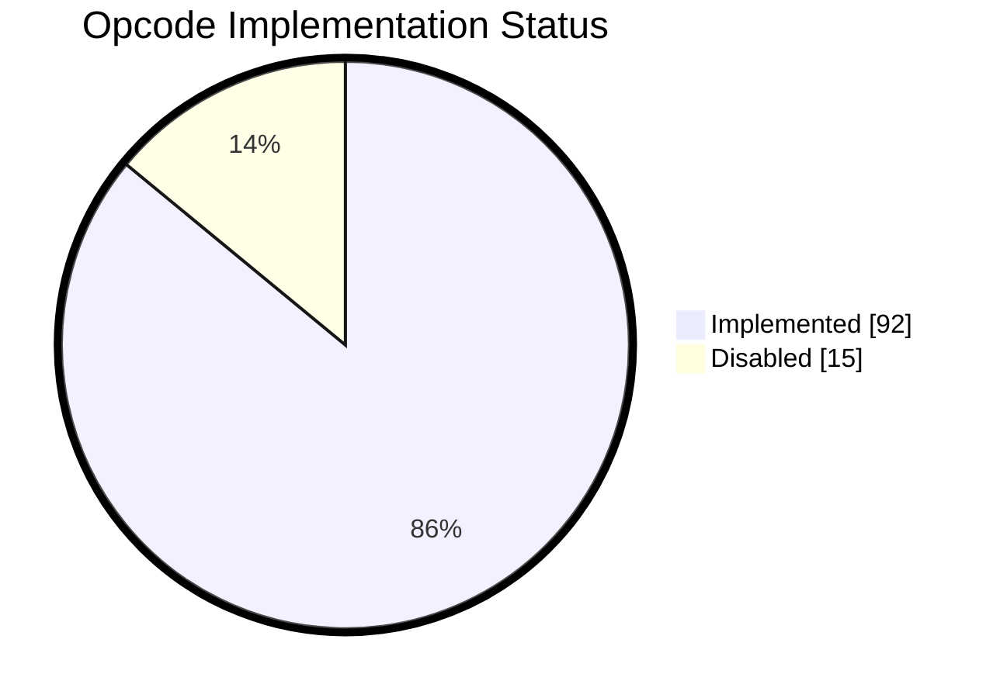

# Supported Opcodes

107/107 opcodes supported (100%).

Disabled/Enabled opcodes match the current Bitcoin mainnet consensus/execution rules, such as Bitwise operations being disabled.
Soon, we hope to allow custom opcode rules through flags to enable/disable/customize allowed opcodes.

| Opcode                 | Hex       | Supported | Description                                                                                                                                                                                                                                                                                                                                                                                                                                                                                                                        |
| ---------------------- | --------- | :-------: | ---------------------------------------------------------------------------------------------------------------------------------------------------------------------------------------------------------------------------------------------------------------------------------------------------------------------------------------------------------------------------------------------------------------------------------------------------------------------------------------------------------------------------------- |
| OP_0 / OP_FALSE        | 0x00      |     ✅     | An empty array of bytes is pushed onto the stack.                                                                                                                                                                                                                                                                                                                                                                                                                                                                                  |
| OP_DATA_1-OP_DATA_75   | 0x01-0x4b |     ✅     | The next opcode bytes is data to be pushed onto the stack.                                                                                                                                                                                                                                                                                                                                                                                                                                                            |
| OP_PUSHDATA1           | 0x4c      |     ✅     | The next byte contains the number of bytes to be pushed onto the stack.                                                                                                                                                                                                                                                                                                                                                                                                                                                            |
| OP_PUSHDATA2           | 0x4d      |     ✅     | The next two bytes contain the number of bytes to be pushed onto the stack in little endian order.                                                                                                                                                                                                                                                                                                                                                                                                                                 |
| OP_PUSHDATA4           | 0x4e      |     ✅     | The next four bytes contain the number of bytes to be pushed onto the stack in little endian order.                                                                                                                                                                                                                                                                                                                                                                                                                                |
| OP_1NEGATE             | 0x4f      |     ✅     | The number -1 is pushed onto the stack.                                                                                                                                                                                                                                                                                                                                                                                                                                                                                            |
| OP_RESERVED            | 0x50      |     ✅     | Transaction is invalid unless occurring in an unexecuted OP_IF branch                                                                                                                                                                                                                                                                                                                                                                                                                                                              |
| OP_1 / OP_TRUE         | 0x51      |     ✅     | The number 1 is pushed onto the stack.                                                                                                                                                                                                                                                                                                                                                                                                                                                                                             |
| OP_2                   | 0x52      |     ✅     | The number 2 is pushed onto the stack.                                                                                                                                                                                                                                                                                                                                                                                                                                                                                             |
| OP_3                   | 0x53      |     ✅     | The number 3 is pushed onto the stack.                                                                                                                                                                                                                                                                                                                                                                                                                                                                                             |
| OP_4                   | 0x54      |     ✅     | The number 4 is pushed onto the stack.                                                                                                                                                                                                                                                                                                                                                                                                                                                                                             |
| OP_5                   | 0x55      |     ✅     | The number 5 is pushed onto the stack.                                                                                                                                                                                                                                                                                                                                                                                                                                                                                             |
| OP_6                   | 0x56      |     ✅     | The number 6 is pushed onto the stack.                                                                                                                                                                                                                                                                                                                                                                                                                                                                                             |
| OP_7                   | 0x57      |     ✅     | The number 7 is pushed onto the stack.                                                                                                                                                                                                                                                                                                                                                                                                                                                                                             |
| OP_8                   | 0x58      |     ✅     | The number 8 is pushed onto the stack.                                                                                                                                                                                                                                                                                                                                                                                                                                                                                             |
| OP_9                   | 0x59      |     ✅     | The number 9 is pushed onto the stack.                                                                                                                                                                                                                                                                                                                                                                                                                                                                                             |
| OP_10                  | 0x5a      |     ✅     | The number 10 is pushed onto the stack.                                                                                                                                                                                                                                                                                                                                                                                                                                                                                            |
| OP_11                  | 0x5b      |     ✅     | The number 11 is pushed onto the stack.                                                                                                                                                                                                                                                                                                                                                                                                                                                                                            |
| OP_12                  | 0x5c      |     ✅     | The number 12 is pushed onto the stack.                                                                                                                                                                                                                                                                                                                                                                                                                                                                                            |
| OP_13                  | 0x5d      |     ✅     | The number 13 is pushed onto the stack.                                                                                                                                                                                                                                                                                                                                                                                                                                                                                            |
| OP_14                  | 0x5e      |     ✅     | The number 14 is pushed onto the stack.                                                                                                                                                                                                                                                                                                                                                                                                                                                                                            |
| OP_15                  | 0x5f      |     ✅     | The number 15 is pushed onto the stack.                                                                                                                                                                                                                                                                                                                                                                                                                                                                                            |
| OP_16                  | 0x60      |     ✅     | The number 16 is pushed onto the stack.                                                                                                                                                                                                                                                                                                                                                                                                                                                                                            |
| OP_NOP                 | 0x61      |     ✅     | Does nothing.                                                                                                                                                                                                                                                                                                                                                                                                                                                                                                                      |
| OP_VER                 | 0x62      |     ✅     | Transaction is invalid unless occurring in an unexecuted OP_IF branch                                                                                                                                                                                                                                                                                                                                                                                                                                                              |
| OP_IF                  | 0x63      |     ✅     | If the top stack value is not False, the statements are executed. The top stack value is removed.                                                                                                                                                                                                                                                                                                                                                                                                                                  |
| OP_NOTIF               | 0x64      |     ✅     | If the top stack value is False, the statements are executed. The top stack value is removed.                                                                                                                                                                                                                                                                                                                                                                                                                                      |
| OP_VERIF               | 0x65      |     ✅     | Transaction is invalid even when occurring in an unexecuted OP_IF branch                                                                                                                                                                                                                                                                                                                                                                                                                                                           |
| OP_VERNOTIF            | 0x66      |     ✅     | Transaction is invalid even when occurring in an unexecuted OP_IF branch                                                                                                                                                                                                                                                                                                                                                                                                                                                           |
| OP_ELSE                | 0x67      |     ✅     | If the preceding OP_IF or OP_NOTIF or OP_ELSE was not executed then these statements are and if the preceding OP_IF or OP_NOTIF or OP_ELSE was executed then these statements are not.                                                                                                                                                                                                                                                                                                                                             |
| OP_ENDIF               | 0x68      |     ✅     | Ends an if/else block.                                                                                                                                                                                                                                                                                                                                                                                                                                                                                                             |
| OP_VERIFY              | 0x69      |     ✅     | Marks transaction as invalid if top stack value is not true.                                                                                                                                                                                                                                                                                                                                                                                                                                                                       |
| OP_RETURN              | 0x6a      |     ✅     | Marks transaction as invalid.                                                                                                                                                                                                                                                                                                                                                                                                                                                                                                      |
| OP_TOALTSTACK          | 0x6b      |     ✅     | Puts the input onto the top of the alt stack. Removes it from the main stack.                                                                                                                                                                                                                                                                                                                                                                                                                                                      |
| OP_FROMALTSTACK        | 0x6c      |     ✅     | Puts the input onto the top of the main stack. Removes it from the alt stack.                                                                                                                                                                                                                                                                                                                                                                                                                                                      |
| OP_2DROP               | 0x6d      |     ✅     | Removes the top two stack items.                                                                                                                                                                                                                                                                                                                                                                                                                                                                                                   |
| OP_2DUP                | 0x6e      |     ✅     | Duplicates the top two stack items.                                                                                                                                                                                                                                                                                                                                                                                                                                                                                                |
| OP_3DUP                | 0x6f      |     ✅     | Duplicates the top three stack items.                                                                                                                                                                                                                                                                                                                                                                                                                                                                                              |
| OP_2OVER               | 0x70      |     ✅     | Copies the pair of items two spaces back in the stack to the front.                                                                                                                                                                                                                                                                                                                                                                                                                                                                |
| OP_2ROT                | 0x71      |     ✅     | The fifth and sixth items back are moved to the top of the stack.                                                                                                                                                                                                                                                                                                                                                                                                                                                                  |
| OP_2SWAP               | 0x72      |     ✅     | Swaps the top two pairs of items.                                                                                                                                                                                                                                                                                                                                                                                                                                                                                                  |
| OP_IFDUP               | 0x73      |     ✅     | If the top stack value is not 0, duplicate it.                                                                                                                                                                                                                                                                                                                                                                                                                                                                                     |
| OP_DEPTH               | 0x74      |     ✅     | Puts the number of stack items onto the stack.                                                                                                                                                                                                                                                                                                                                                                                                                                                                                     |
| OP_DROP                | 0x75      |     ✅     | Removes the top stack item.                                                                                                                                                                                                                                                                                                                                                                                                                                                                                                        |
| OP_DUP                 | 0x76      |     ✅     | Duplicates the top stack item.                                                                                                                                                                                                                                                                                                                                                                                                                                                                                                     |
| OP_NIP                 | 0x77      |     ✅     | Removes the second-to-top stack item.                                                                                                                                                                                                                                                                                                                                                                                                                                                                                              |
| OP_OVER                | 0x78      |     ✅     | Copies the second-to-top stack item to the top.                                                                                                                                                                                                                                                                                                                                                                                                                                                                                    |
| OP_PICK                | 0x79      |     ✅     | The item n back in the stack is copied to the top.                                                                                                                                                                                                                                                                                                                                                                                                                                                                                 |
| OP_ROLL                | 0x7a      |     ✅     | The item n back in the stack is moved to the top.                                                                                                                                                                                                                                                                                                                                                                                                                                                                                  |
| OP_ROT                 | 0x7b      |     ✅     | The top three items on the stack are rotated to the left.                                                                                                                                                                                                                                                                                                                                                                                                                                                                          |
| OP_SWAP                | 0x7c      |     ✅     | The top two items on the stack are swapped.                                                                                                                                                                                                                                                                                                                                                                                                                                                                                        |
| OP_TUCK                | 0x7d      |     ✅     | The item at the top of the stack is copied and inserted before the second-to-top item.                                                                                                                                                                                                                                                                                                                                                                                                                                             |
| OP_CAT                 | 0x7e      |     ❗     | Concatenates two strings. Disabled.                                                                                                                                                                                                                                                                                                                                                                                                                                                                                                |
| OP_SUBSTR              | 0x7f      |     ❗     | Returns a section of a string. Disabled.                                                                                                                                                                                                                                                                                                                                                                                                                                                                                           |
| OP_LEFT                | 0x80      |     ❗     | Keeps only characters left of the specified point in a string. Disabled.                                                                                                                                                                                                                                                                                                                                                                                                                                                           |
| OP_RIGHT               | 0x81      |     ❗     | Keeps only characters right of the specified point in a string. Disabled.                                                                                                                                                                                                                                                                                                                                                                                                                                                          |
| OP_SIZE                | 0x82      |     ✅     | Pushes the string length of the top element of the stack (without popping it).                                                                                                                                                                                                                                                                                                                                                                                                                                                     |
| OP_INVERT              | 0x83      |     ❗     | Flips all of the bits in the input. Disabled.                                                                                                                                                                                                                                                                                                                                                                                                                                                                                      |
| OP_AND                 | 0x84      |     ❗     | Boolean and between each bit in the inputs. Disabled.                                                                                                                                                                                                                                                                                                                                                                                                                                                                              |
| OP_OR                  | 0x85      |     ❗     | Boolean or between each bit in the inputs. Disabled.                                                                                                                                                                                                                                                                                                                                                                                                                                                                               |
| OP_XOR                 | 0x86      |     ❗     | Boolean exclusive or between each bit in the inputs. Disabled.                                                                                                                                                                                                                                                                                                                                                                                                                                                                     |
| OP_EQUAL               | 0x87      |     ✅     | Returns 1 if the inputs are exactly equal, 0 otherwise.                                                                                                                                                                                                                                                                                                                                                                                                                                                                            |
| OP_EQUALVERIFY         | 0x88      |     ✅     | Same as OP_EQUAL, but runs OP_VERIFY afterward.                                                                                                                                                                                                                                                                                                                                                                                                                                                                                    |
| OP_RESERVED1           | 0x89      |     ✅     | Transaction is invalid unless occurring in an unexecuted OP_IF branch                                                                                                                                                                                                                                                                                                                                                                                                                                                              |
| OP_RESERVED2           | 0x8a      |     ✅     | Transaction is invalid unless occurring in an unexecuted OP_IF branch                                                                                                                                                                                                                                                                                                                                                                                                                                                              |
| OP_1ADD                | 0x8b      |     ✅     | 1 is added to the input.                                                                                                                                                                                                                                                                                                                                                                                                                                                                                                           |
| OP_1SUB                | 0x8c      |     ✅     | 1 is subtracted from the input.                                                                                                                                                                                                                                                                                                                                                                                                                                                                                                    |
| OP_2MUL                | 0x8d      |     ❗     | The input is multiplied by 2. Disabled.                                                                                                                                                                                                                                                                                                                                                                                                                                                                                            |
| OP_2DIV                | 0x8e      |     ❗     | The input is divided by 2. Disabled.                                                                                                                                                                                                                                                                                                                                                                                                                                                                                               |
| OP_NEGATE              | 0x8f      |     ✅     | The sign of the input is flipped.                                                                                                                                                                                                                                                                                                                                                                                                                                                                                                  |
| OP_ABS                 | 0x90      |     ✅     | The input is made positive.                                                                                                                                                                                                                                                                                                                                                                                                                                                                                                        |
| OP_NOT                 | 0x91      |     ✅     | If the input is 0 or 1, it is flipped. Otherwise the output will be 0.                                                                                                                                                                                                                                                                                                                                                                                                                                                             |
| OP_0NOTEQUAL           | 0x92      |     ✅     | Returns 0 if the input is 0. 1 otherwise.                                                                                                                                                                                                                                                                                                                                                                                                                                                                                          |
| OP_ADD                 | 0x93      |     ✅     | a is added to b.                                                                                                                                                                                                                                                                                                                                                                                                                                                                                                                   |
| OP_SUB                 | 0x94      |     ✅     | b is subtracted from a.                                                                                                                                                                                                                                                                                                                                                                                                                                                                                                            |
| OP_MUL                 | 0x95      |     ❗     | a is multiplied by b. Disabled.                                                                                                                                                                                                                                                                                                                                                                                                                                                                                                    |
| OP_DIV                 | 0x96      |     ❗     | a is divided by b. Disabled.                                                                                                                                                                                                                                                                                                                                                                                                                                                                                                       |
| OP_MOD                 | 0x97      |     ❗     | Returns the remainder after dividing a by b. Disabled.                                                                                                                                                                                                                                                                                                                                                                                                                                                                             |
| OP_LSHIFT              | 0x98      |     ❗     | Shifts a left b bits, preserving sign. Disabled.                                                                                                                                                                                                                                                                                                                                                                                                                                                                                   |
| OP_RSHIFT              | 0x99      |     ❗     | Shifts a right b bits, preserving sign. Disabled.                                                                                                                                                                                                                                                                                                                                                                                                                                                                                  |
| OP_BOOLAND             | 0x9a      |     ✅     | If both a and b are not 0, the output is 1. Otherwise 0.                                                                                                                                                                                                                                                                                                                                                                                                                                                                           |
| OP_BOOLOR              | 0x9b      |     ✅     | If a or b is not 0, the output is 1. Otherwise 0.                                                                                                                                                                                                                                                                                                                                                                                                                                                                                  |
| OP_NUMEQUAL            | 0x9c      |     ✅     | Returns 1 if the numbers are equal, 0 otherwise.                                                                                                                                                                                                                                                                                                                                                                                                                                                                                   |
| OP_NUMEQUALVERIFY      | 0x9d      |     ✅     | Same as OP_NUMEQUAL, but runs OP_VERIFY afterward.                                                                                                                                                                                                                                                                                                                                                                                                                                                                                 |
| OP_NUMNOTEQUAL         | 0x9e      |     ✅     | Returns 1 if the numbers are not equal, 0 otherwise.                                                                                                                                                                                                                                                                                                                                                                                                                                                                               |
| OP_LESSTHAN            | 0x9f      |     ✅     | Returns 1 if a is less than b, 0 otherwise.                                                                                                                                                                                                                                                                                                                                                                                                                                                                                        |
| OP_GREATERTHAN         | 0xa0      |     ✅     | Returns 1 if a is greater than b, 0 otherwise.                                                                                                                                                                                                                                                                                                                                                                                                                                                                                     |
| OP_LESSTHANOREQUAL     | 0xa1      |     ✅     | Returns 1 if a is less than or equal to b, 0 otherwise.                                                                                                                                                                                                                                                                                                                                                                                                                                                                            |
| OP_GREATERTHANOREQUAL  | 0xa2      |     ✅     | Returns 1 if a is greater than or equal to b, 0 otherwise.                                                                                                                                                                                                                                                                                                                                                                                                                                                                         |
| OP_MIN                 | 0xa3      |     ✅     | Returns the smaller of a and b.                                                                                                                                                                                                                                                                                                                                                                                                                                                                                                    |
| OP_MAX                 | 0xa4      |     ✅     | Returns the larger of a and b.                                                                                                                                                                                                                                                                                                                                                                                                                                                                                                     |
| OP_WITHIN              | 0xa5      |     ✅     | Returns 1 if x is within the specified range (left-inclusive), 0 otherwise.                                                                                                                                                                                                                                                                                                                                                                                                                                                        |
| OP_RIPEMD160           | 0xa6      |     ✅     | The input is hashed using RIPEMD-160.                                                                                                                                                                                                                                                                                                                                                                                                                                                                                              |
| OP_SHA1                | 0xa7      |     ✅     | The input is hashed using SHA-1.                                                                                                                                                                                                                                                                                                                                                                                                                                                                                                   |
| OP_SHA256              | 0xa8      |     ✅     | The input is hashed using SHA-256.                                                                                                                                                                                                                                                                                                                                                                                                                                                                                                 |
| OP_HASH160             | 0xa9      |     ✅     | The input is hashed twice: first with SHA-256 and then with RIPEMD-160.                                                                                                                                                                                                                                                                                                                                                                                                                                                            |
| OP_HASH256             | 0xaa      |     ✅     | The input is hashed two times with SHA-256.                                                                                                                                                                                                                                                                                                                                                                                                                                                                                        |
| OP_CODESEPARATOR       | 0xab      |     ✅     | All of the signature checking words will only match signatures to the data after the most recently-executed OP_CODESEPARATOR.                                                                                                                                                                                                                                                                                                                                                                                                      |
| OP_CHECKSIG            | 0xac      |     ✅     | The entire transaction's outputs, inputs, and script are hashed. The signature used by OP_CHECKSIG must be a valid signature for this hash and public key. If it is, 1 is returned, 0 otherwise.                                                                                                                                                                                                                                                                                                                                   |
| OP_CHECKSIGVERIFY      | 0xad      |     ✅     | Same as OP_CHECKSIG, but OP_VERIFY is executed afterward.                                                                                                                                                                                                                                                                                                                                                                                                                                                                          |
| OP_CHECKMULTISIG       | 0xae      |     ✅     | Compares the first signature against each public key until it finds an ECDSA match. Starting with the subsequent public key, it compares the second signature against each remaining public key until it finds an ECDSA match. The process is repeated until all signatures have been checked or not enough public keys remain to produce a successful result. All signatures need to match a public key. If all signatures are valid, 1 is returned, 0 otherwise. Due to a bug, one extra unused value is removed from the stack. |
| OP_CHECKMULTISIGVERIFY | 0xaf      |     ✅     | Same as OP_CHECKMULTISIG, but OP_VERIFY is executed afterward.                                                                                                                                                                                                                                                                                                                                                                                                                                                                     |
| OP_NOP1                | 0xb0      |     ✅     | The word is ignored. Does not mark transaction as invalid.                                                                                                                                                                                                                                                                                                                                                                                                                                                                         |
| OP_CHECKLOCKTIMEVERIFY | 0xb1      |     ✅     | Marks transaction as invalid if the top stack item is greater than the transaction's nLockTime field, otherwise script evaluation continues as though an OP_NOP was executed.                                                                                                                                                                                                                                                                                                                                                      |
| OP_CHECKSEQUENCEVERIFY | 0xb2      |     ✅     | Marks transaction as invalid if the relative lock time of the input is not equal to or longer than the value of the top stack item.                                                                                                                                                                                                                                                                                                                                                                                                |
| OP_NOP4-OP_NOP10       | 0xb3-0xb9 |     ✅     | The word is ignored. Does not mark transaction as invalid.                                                                                                                                                                                                                                                                                                                                                                                                                                                                         |
| OP_CHECKSIGADD         | 0xba      |     ✅     | Increments n by one and returns to the stack if the signature is valid for the public key and transaction. Only available in tapscript.                                                                                                                                                                                                                                                                                                                                                                                            |
